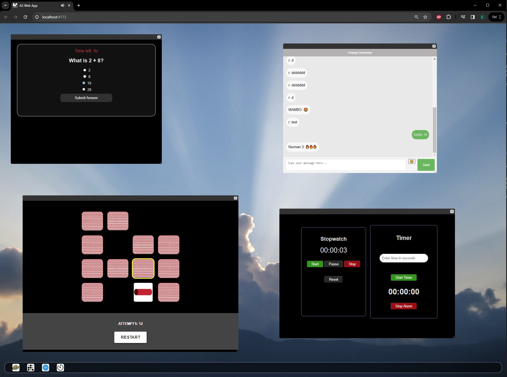

# Personal Web Desktop (PWD)

## Description
The Personal Web Desktop (PWD) is a single-page application that simulates a desktop environment within the browser. Users can open, drag, and interact with multiple custom windows for various applications including a Memory Game, Chat, and a Stopwatch/Timer.

## Features
- **Custom Windows:** Users can open, drag, resize and focus multiple windows within the PWD.
- **Applications:**
  - **Memory Game:** Play multiple instances of a memory game with keyboard controls and sound effects.
  - **Chat:** Connect to a central chat server using WebSockets, with support for multiple chat windows, persistent usernames, and chat history stored in local storage. Includes sound notifications. Additional features are emoji support and username change functionality.
  - **Stopwatch/Timer:** A functional stopwatch and timer application.
  - **Quiz Game:** An interactive quiz game (single instance due to API limitations).

##

